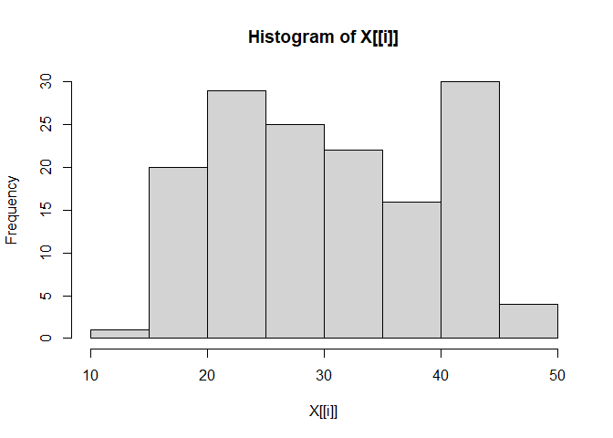
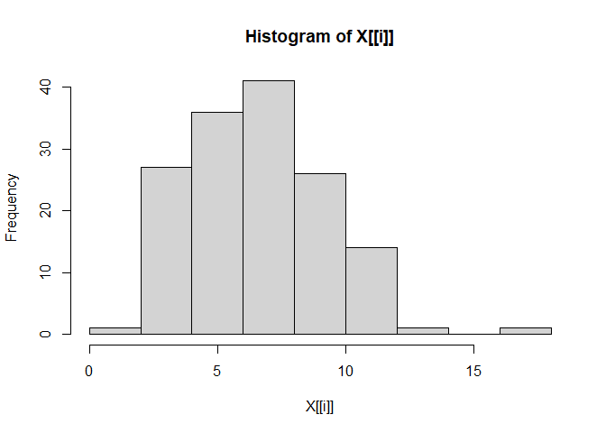
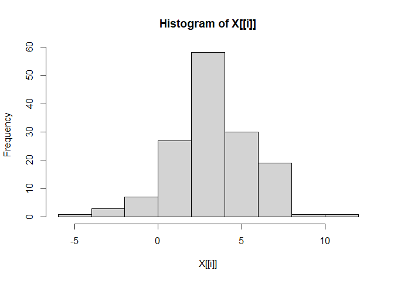
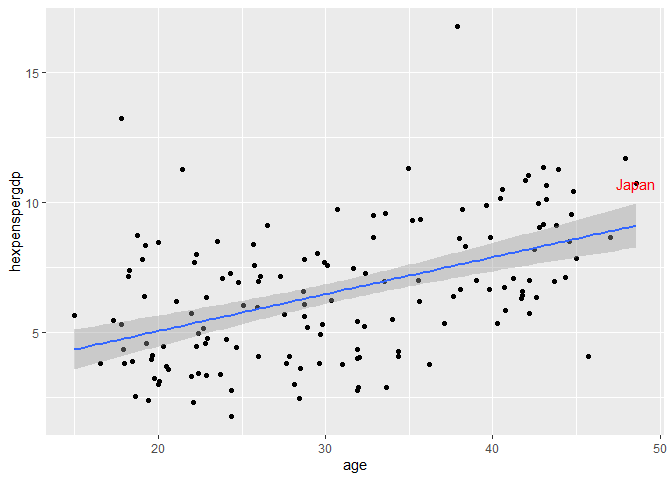
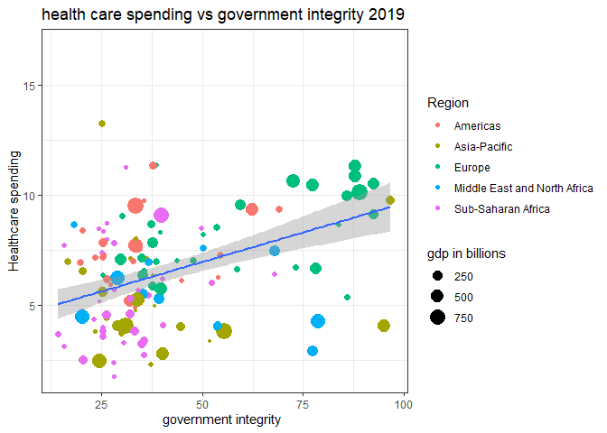
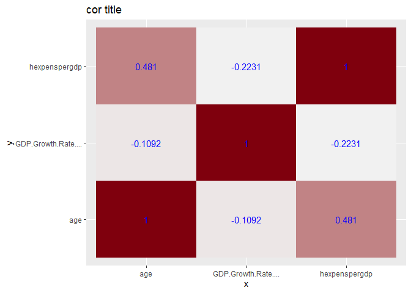
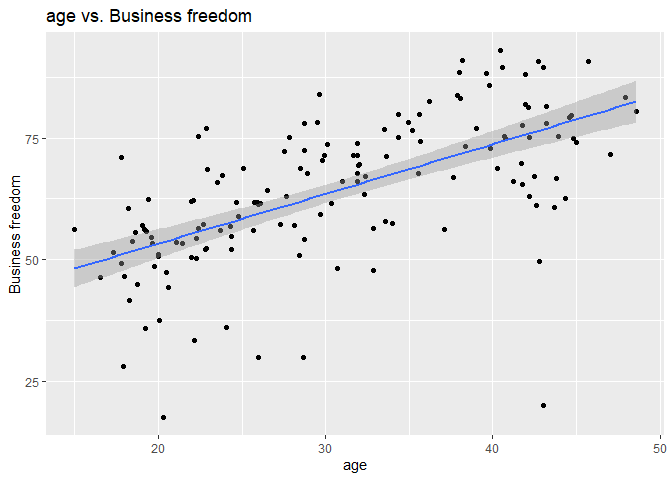

Median Age Vs. Healthcare Expense Across Countries 2019 Comparative
Analysis
================
Grant Gealy

health expenditure from world bank median age from kaggle via UN gdp per
capita data from kaggle This project will focus on the relationship
between the age of a society and other economic factors in order to
better understand the economics of specifically how income level and
average age influence factors such as gdp growth and government
spending. Note (age data is from 2020 due to lack of data for every year
)

``` r
#load library 
#install.packages("reshape2")
library(tidyverse)
library(reshape2)
library(colorspace)
```

``` r
#load age data 
age= read.csv("data/MedianAge.csv")%>% melt()%>%
  rename(year = variable )%>%rename(age =value)%>%
  rename(country = Country)
#get rid of x in the year col
age$year= as.numeric(substr(age$year,2,5))
# pick to analyze 
nage=age%>%filter(year==2020) 
head(age)
```

    ##       country year    age
    ## 1 Afghanistan 1950 18.597
    ## 2     Albania 1950 20.640
    ## 3     Algeria 1950 19.927
    ## 4      Angola 1950 19.401
    ## 5   Argentina 1950 25.657
    ## 6     Armenia 1950 22.423

``` r
##load economic freedom data 
fre = read.csv("data/economic_freedom_index2019_data.csv")%>%
  rename(country = Country.Name)
fre$WEBNAME= NULL


#take out names to make all data numeric then put the names back in 
numfre=sapply(fre[,-c(2,3)], function(x) as.numeric(gsub(
        "$","",x,fixed=TRUE))) 
frename=cbind(fre[,2:3],numfre) 
#check data type for every col
 
asclass=sapply(fre,class) 
head(asclass)
```

    ##   CountryID     country      Region  World.Rank Region.Rank X2019.Score 
    ##   "integer" "character" "character" "character" "character" "character"

``` r
##load health data 
health = read.csv("data/health.csv")%>%
  select(-c(Country.Code,Indicator.Name, Indicator.Code))%>%rename(country =ï..Country.Name)%>%melt(id.vars= "country")%>%rename(year = variable)%>%rename(hexpenspergdp =value)%>%na.omit()
#get rid of x in the year col 
health$year= as.numeric(substr(health$year,2,5)) 
head(health)
```

    ##                           country year hexpenspergdp
    ## 10642 Africa Eastern and Southern 2000      6.252428
    ## 10644  Africa Western and Central 2000      3.771294
    ## 10645                      Angola 2000      1.908599
    ## 10646                     Albania 2000      7.233370
    ## 10647                     Andorra 2000      5.960511
    ## 10648                  Arab World 2000      4.000923

``` r
#get the values just for 2020  
healthyear=health[health$year==2019,]
```

``` r
#make one data set From the separate data sets 

data=merge(frename,healthyear,"country",all.x = TRUE)
fulldata=merge(data,nage,"country",all.x = TRUE)%>%drop_na(c(age,hexpenspergdp))
```

start analysis exploratory

``` r
#we found the summary statistics for age an, health expenses 
#and gdp growth rate 
fulldata%>%select(age,hexpenspergdp,GDP.Growth.Rate....
                  )%>%summary() 
```

    ##       age        hexpenspergdp    GDP.Growth.Rate....
    ##  Min.   :14.99   Min.   : 1.798   Min.   :-4.400     
    ##  1st Qu.:22.75   1st Qu.: 4.349   1st Qu.: 2.000     
    ##  Median :29.82   Median : 6.411   Median : 3.100     
    ##  Mean   :30.74   Mean   : 6.589   Mean   : 3.348     
    ##  3rd Qu.:39.30   3rd Qu.: 8.437   3rd Qu.: 4.850     
    ##  Max.   :48.58   Max.   :16.767   Max.   :10.900

``` r
#make histograms for variable of interest 
sapply(fulldata%>%select(age,hexpenspergdp,GDP.Growth.Rate....
                  ),hist) 
```

<!-- --><!-- --><!-- -->

    ##          age       hexpenspergdp GDP.Growth.Rate....
    ## breaks   integer,9 numeric,10    numeric,10         
    ## counts   integer,8 integer,9     integer,9          
    ## density  numeric,8 numeric,9     numeric,9          
    ## mids     numeric,8 numeric,9     numeric,9          
    ## xname    "X[[i]]"  "X[[i]]"      "X[[i]]"           
    ## equidist TRUE      TRUE          TRUE

``` r
#find cor of variables of interest save it to a variable so we 
#can graph it 
test=fulldata%>%select(age,hexpenspergdp,GDP.Growth.Rate.... )%>%na.omit()%>%cor()%>%as.data.frame()
test=test%>%mutate(variable =row.names(test))%>%pivot_longer(cols = 0:3,names_to= "var2",values_to = "cor")
```

``` r
selected=fulldata[fulldata$country=="Japan",]
healthyear=health[health$year==2019,]
#make a graph plotting age and health expenses/gdp to illustrate the relationship between the age of a society 
#and the amount they investorsinvest in Healthcare 
ggplot(fulldata,aes(age,hexpenspergdp))+geom_point()+
  geom_smooth(method = lm)+geom_text(data = selected,mapping=aes(x=age,y=hexpenspergdp,label=country ),color="red")
```

    ## `geom_smooth()` using formula 'y ~ x'

<!-- -->

``` r
#make a graph plotting government integrity and health expenses I did this to show how corruption in poorer countries might exaggerate the health expenses actually going towards the people
ggplot(fulldata,aes(fulldata$Government.Integrity,hexpenspergdp))+geom_point(aes(size=GDP..Billions..PPP.,color=Region))+geom_smooth(method=lm)+labs(title = "health care spending vs government integrity 2019",y="Healthcare spending",x="government integrity ",size= "gdp in billions" ,color= "Region")+theme_bw()+geom_text(data = selected,mapping=aes(x=Government.Integrity,y=hexpenspergdp,label=country ))
```

    ## Warning: Use of `fulldata$Government.Integrity` is discouraged. Use `Government.Integrity` instead.
    ## Use of `fulldata$Government.Integrity` is discouraged. Use `Government.Integrity` instead.

    ## `geom_smooth()` using formula 'y ~ x'

    ## Warning: Removed 20 rows containing missing values (geom_point).

<!-- -->

``` r
#make a graph showing the cor 
ggplot(test,aes(y=var2,x= variable, fill =cor))+geom_tile()+geom_text(aes(label= round(cor,4)), color ="blue ")+labs(title ="cor title ",y="y",x="x")+theme(legend.position = "none")+scale_fill_continuous_sequential(palette="red")
```

<!-- -->

``` r
ggplot(fulldata,aes(age,Business.Freedom))+geom_point()+geom_smooth(method="lm")+labs(title = "age vs. Business freedom",x="age",y=" Business freedom ")
```

    ## `geom_smooth()` using formula 'y ~ x'

<!-- -->

``` r
#ran a regression to show the relationship between Healthcare expenses and average I find that Healthcare expenses as a percentage of gdp goes up ~ .1419986 For every year older of population with a standard error of 0.02149%.Highlighting The importance of efficient Healthcare delivery in ageing Healthcare. 
agegdp=lm(fulldata$hexpenspergdp~age,data = fulldata)
summary(agegdp)
```

    ## 
    ## Call:
    ## lm(formula = fulldata$hexpenspergdp ~ age, data = fulldata)
    ## 
    ## Residuals:
    ##     Min      1Q  Median      3Q     Max 
    ## -4.6332 -1.6417 -0.2878  1.6220  9.1659 
    ## 
    ## Coefficients:
    ##             Estimate Std. Error t value Pr(>|t|)    
    ## (Intercept)  2.22394    0.68803   3.232  0.00152 ** 
    ## age          0.14200    0.02149   6.606 6.99e-10 ***
    ## ---
    ## Signif. codes:  0 '***' 0.001 '**' 0.01 '*' 0.05 '.' 0.1 ' ' 1
    ## 
    ## Residual standard error: 2.327 on 145 degrees of freedom
    ## Multiple R-squared:  0.2313, Adjusted R-squared:  0.226 
    ## F-statistic: 43.64 on 1 and 145 DF,  p-value: 6.99e-10

``` r
agegdp$coefficients
```

    ## (Intercept)         age 
    ##   2.2239435   0.1419986

``` r
usa=which(fulldata$country=="United States")
agegdp$residuals[usa]
```

    ##      141 
    ## 9.165917

``` r
#as a society ages they spend more on health 

#can we also do the growth rate 
#as yes that's what I am thinking 
```

\|
